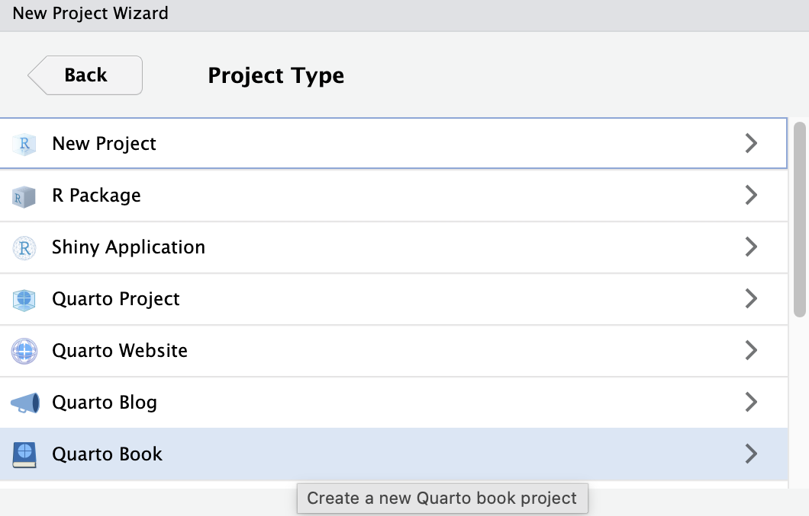
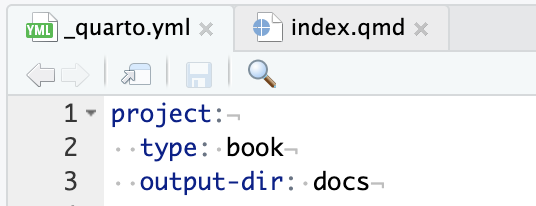
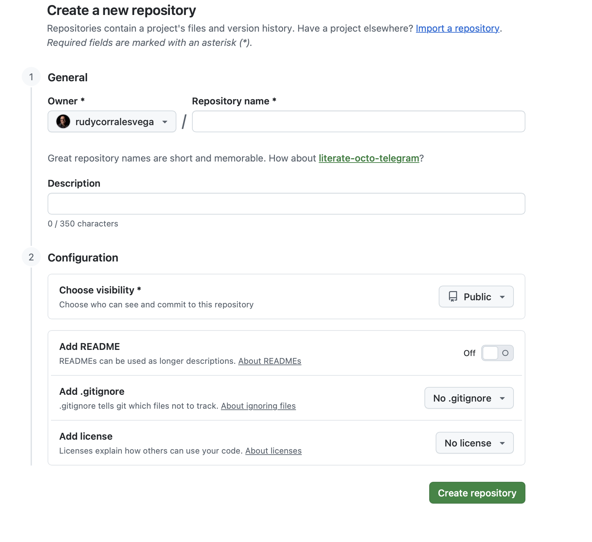
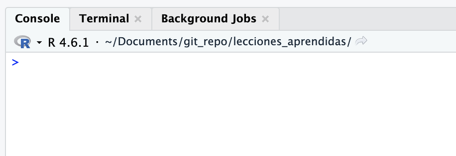

# ¿Cómo se hace este documento?

La publicación de este sitio es el resultado de la combinación de algunas tecnologías y un par de conocimientos de cómo ejecutarlas. Quizás alguno de los lectores tenga interés en hacer algo como esto y por lo tanto le comparto el detalle de como lograrlo

## Herramientas

Para poder crear un sitio como este se requiere tener algunas herramientas instaldas:

1.  Debes tener [RStudio](https://posit.co/downloads)
2.  Por supuesto que debes tener [R](https://cran.r-project.org)
3.  Debes tener [Quarto](https://quarto.org)
4.  Debes tener una cuenta abierta de [GitHub](https://github.com)
5.  No es indispensable, pero si te gustan los textos científicos, debes tener [TeX](https://miktex.org)

## Paso 1

El primer paso para iniciar esta aventura es abrir RStudio y crear un Nuevo Proyecto\>Quarto, según se ilustra en la imagen adjunta

## Paso 2

El Paso 2 es ajustar uno de los archivos que genera el Quarto, para que el codigo de la página se ubique en una nueva carpeta que llamaremos "docs". El archivo que administra estos detalles se llama \_quarto.yml, allí debemos agregar una linea hija de project que indique que el directorio de salida "output dir" para los archivos renderizados se almacenarán en "docs", tal y como se muestra en la siguiente imagen:

 \## Paso 3 Este es un buen momento para hacer un render y verificar que la nueva página se ha creado bien. Revise que en el directorio "doc" estan los archivos. RStudio abrirá una pagina web, así se ira mostrando los cambios que se vayan ejecutando. Conviene invertir tiempo en cambiar frases, agregar secciones, etc. para dominar la sintaxis.

## Paso 4

El paso 4 se lleva a cabo en GitHub. Allí se debe crear un nuevo proyecto, preferiblemente con el nombre del que hemos creado en RSudio.

 Al crear el repor en blanco se tendrá acceso a una lista de comandos que debemos guardar. Estos Comando nos servirán para asegurarnos de que RSudio ubicará nuestros archivos en este lugar.

Los códigos de interés son (ya casi los explicamos):

1.  clear
2.  git init
3.  git add .
4.  git commit -m "Primer commit: subiendo proyecto base"
5.  git remote add origin https://github.com/rudycorralesvega/lecciones_aprendidas.git
6.  git push -u origin main

Para los que no están familiarizados con este tipo de instrucciones, "git" es un lenguaje para colaborar varias personas en archivos compartidos. Son un protocolo que ordena como se llevan archivos, en este caso a "GitHub". La lista de códigos que he puesto, parten del hecho de que sólo el author subirá contenido al repositorio.

Favor notar que en RStudio es diferente trabajar en "consola" a trabajar en "terminal". En Consola se manejan las instrucciones de "R", en Terminal pondremos las instrucciones de "Git"

**Primero:** vamos a limpiar la terminal. Esto se hace digitando "clear"

**Segundo**: vamos a iniciar git. Esto se hace digitando "git init"

**Tercero**: vamos a decirle a git que seleccione todos los archivos del proyecto para subirlos al repositorio. Esto se hace digitando "git add ." Nótese que hemos puesto un punto, señal en git para indicar todo.
