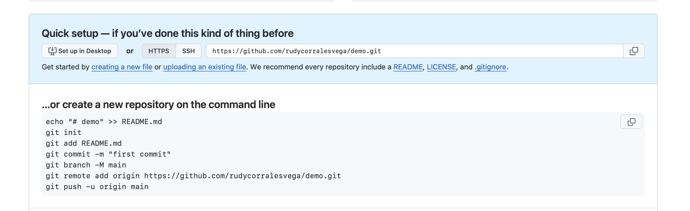
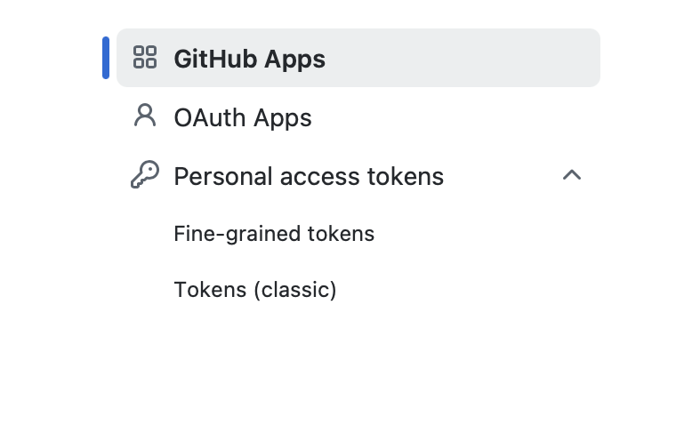
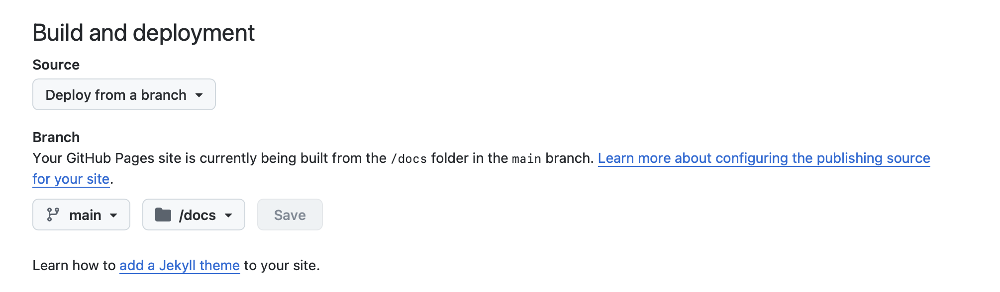
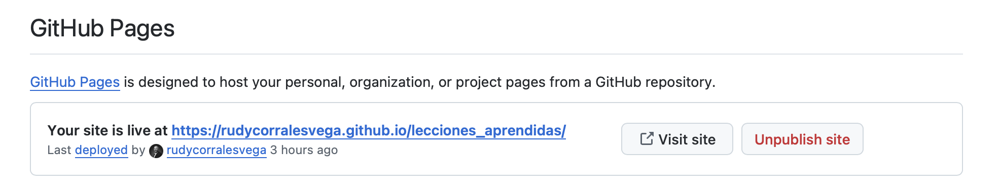

# ¿Cómo se hace este sitio?

La publicación de este sitio es el resultado de la combinación de algunas tecnologías y un par de conocimientos de cómo ejecutarlas. Quizás alguno de los lectores tenga interés en hacer algo como esto y por lo tanto le comparto el detalle de como lograrlo

## Herramientas

Para poder crear un sitio como este se requiere tener algunas herramientas instaladas:

1.  Debes tener [RStudio](https://posit.co/downloads)
2.  Por supuesto que debes tener [R](https://cran.r-project.org)
3.  Debes tener [Quarto](https://quarto.org)
4.  Debes tener una cuenta abierta de [GitHub](https://github.com)
5.  No es indispensable, pero si te gustan los textos científicos, debes tener [TeX](https://miktex.org)

## Paso 1

El primer paso para iniciar esta aventura es abrir RStudio y crear un Nuevo Proyecto\>Quarto, según se ilustra en la imagen adjunta

## Paso 2

El Paso 2 es ajustar uno de los archivos que genera el Quarto, para que el código de la página se ubique en una nueva carpeta que llamaremos "docs". El archivo que administra estos detalles se llama \_quarto.yml, allí debemos agregar una linea hija de project que indique que el directorio de salida "output dir" para los archivos renderizados se almacenarán en "docs", tal y como se muestra en la siguiente imagen:

 \## Paso 3 Este es un buen momento para hacer un render y verificar que la nueva página se ha creado bien. Revise que en el directorio "doc" están los archivos. RStudio abrirá una pagina web, así se ira mostrando los cambios que se vayan ejecutando. Conviene invertir tiempo en cambiar frases, agregar secciones, etc. para dominar la sintaxis.

## Paso 4

El paso 4 se lleva a cabo en GitHub. Allí se debe crear un nuevo proyecto, preferiblemente con el nombre del que hemos creado en RStudio.

 Al crear el repo en blanco se tendrá acceso a una lista de comandos que debemos guardar. Estos Comando nos servirán para asegurarnos de que RStudio ubicará nuestros archivos en este lugar.

Los códigos de interés son (ya casi los explicamos):

1.  clear
2.  git init
3.  git add .
4.  git commit -m "mensaje"
5.  git remote add origin https://github.com/rudycorralesvega/lecciones_aprendidas.git
6.  git push -u origin main

Para los que no están familiarizados con este tipo de instrucciones, "git" es un lenguaje para colaborar varias personas en archivos compartidos. Son un protocolo que ordena como se llevan archivos, en este caso a "GitHub". La lista de códigos que he puesto, parten del hecho de que sólo el autor subirá contenido al repositorio.

Favor notar que en RStudio es diferente trabajar en "consola" a trabajar en "terminal". En Consola se manejan las instrucciones de "R", en Terminal pondremos las instrucciones de "Git"

**Primero:** vamos a limpiar la terminal. Esto se hace digitando "clear"

**Segundo**: vamos a iniciar git. Esto se hace digitando "git init"

**Tercero**: vamos a decirle a git que seleccione todos los archivos del proyecto para subirlos al repositorio. Esto se hace digitando "git add ." Nótese que hemos puesto un punto ("."), señal en git para indicar que todo debe registrarse.

**Cuarto**: el siguiente comando es agregar un comentario a la publicación en el repositorio. Esto es muy útil, para identificar momentos en el tiempo del control de cambios de los archivos. Lo idea es publicar en momentos en que la publicación llega a un estado, por ejemplo: agrega capitulo 1, corrige error en la sección tres, etc. La publicación del comentario se hace "git commit -m "mensaje".

**Quinto**: La quinta etapa sólo se hace una vez. Consiste en cumplir con la seguridad de git para publicar en nuestro repo. Lo primero que debe hacerse es decirle al proyecto en RStudio la ruta de publicación. Esto se toma de la página de creación del repo en GitHub.

 El código de la ruta esta en las lineas que se sugieren al crear el repo. Debe digitarse tal cual en la terminal: git remote add origin "ruta". Lo que este código hace es indicarle a RStudio el lugar remoto donde se ubicará el código. Se indica el concepto "origen" como estándar de git para indicar que ese será el lugar será el almacén de todo el proyecto.

Como parte de este enlace entre GitHub y RStudio lo que sigue es por medio de usuario y password(token). Git te pedirá primero identificar tu usuario. Lo segundo es poner el password. Este es un token que se genera en la misma herramienta Github.

La Ruta para obtener el token es irse a la foto de perfil. En el menú que se despliega seleccionar "settings" y allí en la parte más baja a la izquierda de la página seleccionar "Developer Settings", donde se tendrá la opción de generar los tokens, específicamente la opción (classic)

 Una vez generado el Token, desde RStudio completar en Terminal la etapa de suministro de credenciales.

**Seis** La etapa seis consiste en el envío al repositorio de git de todo lo hecho en RStudio. Incluidos los render que se han almacenado en la carpeta "docs". Ese envió se hace con la instrucción "git push -u origin main", es decir, envié al origen lo que se haya agregado a una rama que en git se llama "main".

Una vez que esta instrucción se ejecuta, hay que verificar que los archivos que estaban en RStudio estén ahora en GitHub.

Conviene hacer cambios en RStudio, repetir los pasos descritos, excepto el de credenciales, que sólo es necesario una vez.

**Publicación** El siguiente y último paso, sólo se hace una vez. Vamos configurar la publicación.

Debemos entrar al proyecto. Allí debe verificarse que los archivos sean los últimos que se desee publicar.

En la parte del menú del repo debe seleccionarse "settings" y allí la sección "pages". A este punto solo queda decirle a la herramienta que nuestra nueva pagina web está en la rama "main" y que los render están en "docs", de la siguiente manera:.

Con esto la aplicación de GitHub iniciará el proceso de preparación de la página y unos minutos después, generalmente son entre 5 y 10 minutos, se desplegará el enlace a la página:

